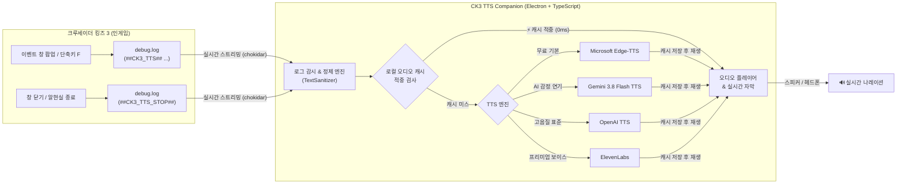

# ⚔️ CK3 TTS Companion

> **크루세이더 킹즈 3(Crusader Kings III) 실시간 음성(TTS) 나레이션 컴패니언**  
> 인게임에서 발생하는 사건, 결단, 결투, 외교, 전쟁, 승계, 알현실 이벤트를 실시간으로 감지하여 **자연스러운 한국어 음성**으로 낭독해 주는 데스크톱 애플리케이션 및 모드입니다.

---

## 🌟 핵심 특징

| 기능 | 설명 |
| :--- | :--- |
| **🎙️ 4대 TTS 엔진 지원** | **Edge-TTS**(무료 고음질), **Gemini 3.8 Flash TTS**(스튜디오급 감정 연기), **OpenAI TTS**(자연스러운 명료함), **ElevenLabs**(프리미엄 AI 음성) 지원 |
| **🎭 오디오 드라마 모드** | 지문(중세 사관 나레이터)과 등장인물 대사("...")를 분리하여 남/여 인물 음성으로 입체적 교차 낭독 |
| **⚡ 로컬 오디오 캐싱** | 반복되는 공통 지문 및 이벤트를 로컬 디스크에 SHA-256 해시로 캐싱하여 **0초(0ms) 지연 즉시 낭독** 및 API 호출 비용 절감 |
| **👑 궁정(Royal Court) 알현실 특화** | 알현실 3D 환경의 안정성을 위해 궁정 주최는 **수동 낭독(단축키: F)**으로 지원하며, 알현실 닫기 시 즉각 오디오 중단(`STOP`) 연동 |
| **🧹 인게임 디버그 클린 모드** | `-debug_mode` 활성화 시 화면을 가리는 보라색 디버그 툴팁, DNA 모디파이어, 지도 좌표, 캐릭터 창 디버그 버튼 자동 숨김 |
| **🍏 Windows & macOS 완벽 지원** | Paradox 게임 로그 경로(`debug.log`)를 자동으로 탐색하여 양대 OS에서 단일 코드베이스로 완벽 구동 |
| **⚡ 전역 단축키 & 실시간 자막** | 게임 전체 화면 중에도 `Ctrl/Cmd + Shift + S`로 낭독 토글 가능, 실시간 오디오 파형 시각화 및 사건 히스토리 대시보드 제공 |

---

## 🏗️ 시스템 아키텍처



---

## 🚀 빠른 시작 가이드 (Quick Start)

### 1단계: 데스크톱 컴패니언 앱 실행

```bash
# 1. 의존성 패키지 설치
npm install

# 2. 개발 모드로 실행
npm run dev
```

> **프로덕션 패키징(배포용 실행 파일 생성)**:
> ```bash
> npm run pack:mac   # macOS용 (.dmg / .zip)
> npm run pack:win   # Windows용 (.exe 설치 파일)
> ```

---

### 2단계: CK3 인게임 모드 자동 동기화

원클릭 동기화 명령어로 모드 파일을 게임 폴더로 즉시 복사합니다:

```bash
npm run sync:mod
```

> **수동 복사가 필요한 경우 모드 설치 경로**:
> - **macOS**: `~/Documents/Paradox Interactive/Crusader Kings III/mod/ck3-tts-companion`
> - **Windows**: `C:\Users\<사용자명>\Documents\Paradox Interactive\Crusader Kings III\mod\ck3-tts-companion`

---

### 3단계: 스팀 시작 옵션 디버그 모드 설정 (필수)

게임 엔진이 `debug.log` 파일에 이벤트 내용을 실시간으로 기록할 수 있도록 디버그 모드를 켭니다.

1. **Steam 라이브러리**에서 **Crusader Kings III** 우클릭 ➔ **[속성(Properties)]** 선택
2. **일반(General)** 탭 하단의 **[시작 옵션(Launch Options)]** 입력란에 아래 명령어 입력:
   ```text
   -debug_mode
   ```
3. **Paradox 런처** 실행 ➔ **[플레이셋(Playsets)]** ➔ **CK3 TTS Companion Bridge** 모드 활성화 후 게임 시작

---

## 🎮 인게임 사용법 및 지원 창

### 조작 단축키

| 동작 | 조작 방법 | 기능 설명 |
| :--- | :--- | :--- |
| **사건 수동 낭독** | **`F` 키** 또는 이벤트 창 스피커 버튼 클릭 | 현재 열려 있는 이벤트 창의 제목과 내용을 즉시 읽습니다. |
| **낭독 일시중지/재개** | **`Ctrl + Shift + S`** (macOS: `Cmd + Shift + S`) | 전체 화면 플레이 중 언제든지 음성을 즉시 멈추거나 다시 재생합니다. |
| **자동 낭독 모드** | 컴패니언 앱 상단의 **[이벤트 자동 낭독]** 체크 | 이벤트 창이 뜨는 즉시 자동으로 TTS 낭독을 시작합니다. |

### 🏛️ 지원되는 인게임 이벤트 창

- **일반 캐릭터 이벤트** (`character_event.gui`): 군주 및 인물 간 일반 서사 사건
- **서신 이벤트** (`letter_event.gui`, `anonymous_letter_event.gui`): 발신자 1인 단일 보이스 편지 완독
- **풀스크린 이벤트** (`fullscreen_event.gui`): 대규모 역사적 결정 및 풀스크린 팝업
- **결투(Duel) 이벤트** (`duel_event.gui`): 라운드별 일대일 대결 내러티브
- **전쟁 결과 창** (`window_war_results.gui`): 전쟁 승리/패배/무효화 결과 낭독
- **동맹 참전 알림** (`interaction_call_ally_notification_window.gui`): 동맹국의 참전 요청 서신
- **상호작용 알림** (`interaction_notification_window.gui`): 투옥, 협박, 청혼 등 인물 통보
- **승계 및 사망 창** (`window_succession_event.gui`): 군주 사망 및 후계자 즉위 사건
- **토너먼트/액티비티 창** (`window_activity.gui`, `window_activity_locale.gui`): 순례, 연회, 마상시합 내러티브
- **궁정(Royal Court) 알현실** (`window_royal_court.gui`, `window_court_events.gui`):
  - 알현실 환경 안정성을 위해 **수동 낭독(단축키: F)** 전용으로 구동
  - 알현실 나가기 및 창 닫힘 시 오디오 즉각 중단(`STOP`) 연동

---

## ⚙️ 4대 TTS 엔진 설정 가이드

앱 우측 상단의 **설정(⚙️)** 버튼을 클릭하여 원하는 음성 엔진을 구성할 수 있습니다.

### 1. Microsoft Edge-TTS (기본 엔진 / 완전 무료)
- 별도의 API 키나 과금 없이 즉시 사용 가능합니다.
- **기본 보이스**: `선희 (ko-KR-SunHiNeural)`, `인준 (ko-KR-InJoonNeural)`, `현수 (ko-KR-HyunsuNeural)`
- **오디오 드라마**: 남성 대사는 `인준`, 여성 대사는 `선희`로 자동 교차 낭독

### 2. Google Gemini 3.8 Flash TTS (AI 나레이터 엔진)
- [Google AI Studio](https://aistudio.google.com/apikey)에서 무료 API 키를 발급받아 입력합니다.
- **모델**: `gemini-3.8-flash-tts` (스튜디오급 고품질)
- **어조 프리셋**: 장엄한 궁정 사관, 백전노장 기사, 은밀한 궁정 모략가, 경건한 대주교, 제왕의 칙령, 사용자 커스텀 프롬프트
- **선택 가능 보이스**: `Charon`(남성/나레이터 추천), `Kore`(여성 추천), `Aoede`, `Fenrir`, `Puck` 등

### 3. OpenAI TTS
- [OpenAI 플랫폼](https://platform.openai.com/api-keys)에서 API 키를 발급받아 입력합니다.
- **모델**: `tts-1` (표준 고속), `tts-1-hd` (스튜디오 고음질)
- **보이스**: `onyx`(남성/나레이터 추천), `nova`(여성 추천), `alloy`, `echo`, `fable`, `shimmer`

### 4. ElevenLabs
- [ElevenLabs](https://elevenlabs.io/) API 키를 발급받아 입력합니다.
- **모델**: `eleven_multilingual_v2`, `eleven_turbo_v2_5`
- **보이스 프리셋 및 Voice ID**: Adam, Rachel, Antoni, Arnold, 사용자 커스텀 Voice ID 직접 입력 지원

---

## 📁 디렉토리 구조

```text
ck3-tts-companion/
├── 📄 package.json              # 프로젝트 메타데이터 및 스크립트
├── 📄 electron.vite.config.ts   # Electron + Vite 통합 빌드 설정 (@/ 별칭)
├── 📄 tsconfig.json             # TypeScript 설정 (엄격 모드)
├── 📁 scripts/                  # 버전 관리 및 모드 동기화 스크립트 (sync-mod, bump-version)
├── 📁 src/
│   ├── 📁 shared/
│   │   ├── 📄 types.ts          # IPC, TTS, 캐시 공통 타입 정의
│   │   ├── 📄 sentenceSplitter.ts # 문장 분할 및 청크 최적화
│   │   ├── 📄 narrativeDialogueSplitter.ts # 오디오 드라마 지문/대사 분리 엔진
│   │   └── 📄 eventDeduplicator.ts # 이벤트 중복 및 콘솔 에코 방어 가드
│   ├── 📁 main/
│   │   ├── 📄 index.ts          # Electron 메인 프로세스, IPC & 전역 단축키
│   │   ├── 📄 pathResolver.ts   # macOS / Windows CK3 로그 경로 자동 탐색
│   │   ├── 📄 textSanitizer.ts  # CK3 서식 태그/툴팁/아이콘 정규식 필터
│   │   ├── 📄 logWatcher.ts     # chokidar 기반 debug.log 실시간 스트리머
│   │   ├── 📄 audioCacheService.ts # SHA-256 기반 로컬 오디오 캐싱 서비스
│   │   └── 📄 ttsService.ts     # Edge, Gemini, OpenAI, ElevenLabs 4대 엔진 통합
│   ├── 📁 preload/
│   │   └── 📄 index.ts          # ContextBridge 기반 타입 안전 IPC 브릿지
│   └── 📁 renderer/
│       ├── 📄 index.html        # 대시보드 마크업
│       ├── 📄 index.css         # 중세 골드 & 다크 글래스모피즘 디자인 시스템
│       ├── 📄 audioVisualizer.ts # Web Audio API 실시간 파형 비주얼라이저
│       └── 📄 main.ts           # 오디오 큐 컨트롤러, 시각화 및 모달 로직
├── 📁 ck3-mod/                  # 인게임 브릿지 모드 패키지
│   ├── 📄 descriptor.mod        # 모드 메타데이터
│   ├── 📄 README.md             # 모드 설치 상세 매뉴얼
│   ├── 📁 common/decisions/     # 테스트용 인게임 결단
│   ├── 📁 localization/replace/ # 디버그 툴팁 정제 로컬라이제이션 (BOM UTF-8)
│   └── 📁 gui/                  # 알현실, 전쟁, 결투, 서신 등 인게임 이벤트 GUI 템플릿
└── 📄 README.md                 # 본 문서
```

---

## 📜 기술 스택 및 오픈소스

- **Desktop Framework**: [Electron 34](https://www.electronjs.org/) + [Vite 6](https://vitejs.dev/) + [electron-vite](https://electron-vite.org/)
- **Language**: [TypeScript 5.7](https://www.typescriptlang.org/) + [Node.js 22](https://nodejs.org/)
- **Audio & TTS Engines**:
  - [`msedge-tts`](https://github.com/schneegans/msedge-tts) - Microsoft Edge Speech Engine
  - [`@google/genai`](https://www.npmjs.com/package/@google/genai) - Google Gemini 3.8 Audio API
  - OpenAI REST Audio API (`/v1/audio/speech`)
  - ElevenLabs REST Audio API (`/v1/text-to-speech`)
- **Korean Processing**: [`es-hangul`](https://es-hangul.slash.page/) - 한글 조사 자동 교정
- **File Watching**: [`chokidar 4`](https://github.com/paulmillr/chokidar)
- **Styling**: Vanilla CSS (CSS Custom Properties, Glassmorphism, Gothic Royal Theme)

---

## 📄 라이선스

본 프로젝트는 **[CC BY-NC-SA 4.0](LICENSE)** (크리에이티브 커먼즈 저작자표시-비상업-동일조건변경허락 4.0 국제) 라이선스를 따릅니다.
- **저작권자**: BlackOlf
- **비상업적 용도**: 개인적 이용, 모딩 커뮤니티 내 무료 공유 및 자유로운 소스코드 수정이 가능합니다.
- **상업적 이용 금지**: 영리 목적(유료 판매, 상업적 서비스 결합 등)의 이용은 엄격히 금지됩니다.
- **동일조건 변경허락**: 2차 저작물 배포 시에도 동일한 CC BY-NC-SA 4.0 라이선스를 적용해야 합니다.
