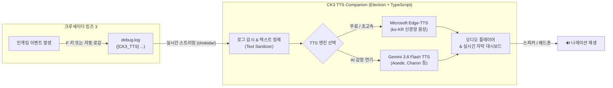

# ⚔️ CK3 TTS Companion

> **크루세이더 킹즈 3(Crusader Kings III) 실시간 음성(TTS) 나레이션 컴패니언**  
> 인게임에서 발생하는 사건, 결단, 결투, 외교 이벤트를 실시간으로 감지하여 **자연스러운 한국어 음성**으로 낭독해 주는 데스크톱 애플리케이션 및 모드입니다.

---

## 🌟 핵심 특징

| 기능 | 설명 |
| :--- | :--- |
| **🎙️ Edge-TTS (기본/무료)** | API 키나 비용 없이 즉시 사용 가능한 고음질 Microsoft 신경망 보이스 (`선희`, `인준`, `현수`) |
| **✨ Gemini 3.8 Flash TTS** | Google의 최신 오디오 특화 모델(`gemini-3.8-flash-tts`) 기반 스튜디오급 감정 연기 및 중세 궁정 나레이터 어조 지원 |
| **🍏 Windows & macOS 지원** | 운영체제에 맞춰 Paradox 게임 로그 경로(`debug.log`)를 자동으로 탐색하여 단일 코드베이스로 구동 |
| **🛡️ 스마트 텍스트 정제** | CK3 게임 특유의 툴팁, 아이콘(`@skill_icon!`), 서식 코드(`#bold`, `#!`, `#color_red`)를 정규식으로 완벽히 필터링 |
| **⚡ 전역 단축키 & 실시간 자막** | 게임 전체 화면 중에도 `Ctrl/Cmd + Shift + S`로 낭독 토글 가능, 오디오 파형 시각화 및 최근 사건 히스토리 제공 |

---

## 🏗️ 시스템 아키텍처



---

## 🚀 빠른 시작 가이드 (Quick Start)

### 1단계: 데스크톱 컴패니언 앱 실행

```bash
# 1. 프로젝트 디렉토리로 이동
cd /Users/pmw0310/Documents/workspace/ck3-tts-companion

# 2. 의존성 패키지 설치
npm install

# 3. 개발 모드로 실행
npm run dev
```

> **프로덕션 빌드(배포용)**가 필요한 경우:
> ```bash
> npm run build
> ```

---

### 2단계: CK3 인게임 모드 설치

프로젝트 내 [`ck3-mod`](./ck3-mod) 디렉토리 전체를 사용 중인 운영체제의 CK3 모드 폴더로 복사합니다.

#### 🍎 macOS
```bash
~/Documents/Paradox Interactive/Crusader Kings III/mod/ck3-tts-companion
```

#### 🪟 Windows
```text
C:\Users\<사용자명>\Documents\Paradox Interactive\Crusader Kings III\mod\ck3-tts-companion
```

---

### 3단계: 스팀 시작 옵션 디버그 모드 설정 (필수)

게임 엔진이 `debug.log` 파일에 이벤트 내용을 실시간으로 기록할 수 있도록 디버그 모드를 켭니다.

1. **Steam 라이브러리**에서 **Crusader Kings III** 우클릭 ➔ **[속성(Properties)]** 선택
2. **일반(General)** 탭 하단의 **[시작 옵션(Launch Options)]** 입력란에 아래 내용 추가:
   ```text
   -debug_mode
   ```
3. **Paradox 런처** 실행 ➔ **[플레이셋(Playsets)]** ➔ **CK3 TTS Companion Bridge** 모드 활성화 후 게임 시작

---

## 🎮 인게임 사용법

| 동작 | 조작 방법 | 기능 설명 |
| :--- | :--- | :--- |
| **사건 수동 낭독** | **`F` 키** 또는 이벤트 창 사운드 버튼 클릭 | 현재 열려 있는 이벤트 창의 제목과 내용을 즉시 읽습니다. |
| **낭독 일시중지/재개** | **`Ctrl + Shift + S`** (macOS: `Cmd + Shift + S`) | 전체 화면 플레이 중 언제든지 음성을 즉시 멈추거나 다시 재생합니다. |
| **자동 낭독 모드** | 컴패니언 앱 상단의 **[이벤트 자동 낭독]** 체크 | 이벤트가 감지되는 즉시 자동으로 TTS 낭독을 시작합니다. |

---

## ⚙️ TTS 엔진 설정 가이드

앱 우측 상단의 **설정(⚙️)** 버튼을 클릭하여 원하는 음성 엔진을 구성할 수 있습니다.

### 1. Microsoft Edge-TTS (기본 엔진)
- 별도의 API 키나 과금 없이 즉시 사용 가능합니다.
- **선택 가능 보이스**:
  - `선희 (ko-KR-SunHiNeural)`: 명료하고 차분한 여성 나레이터
  - `인준 (ko-KR-InJoonNeural)`: 중후하고 신뢰감 있는 남성 군주 톤
  - `현수 (ko-KR-HyunsuNeural)`: 자연스러운 표준 한국어 음성

### 2. Google Gemini 3.8 Flash TTS (AI 나레이터 엔진)
- [Google AI Studio](https://aistudio.google.com/apikey)에서 무료 API 키를 발급받아 입력합니다.
- **모델 선택**:
  - `gemini-3.8-flash-tts`: 스튜디오급 최고 품질 캐릭터 연기 (권장)
  - `gemini-3.8-flash-lite-tts`: 초고속 저지연 처리 특화
- **어조 프리셋**:
  - **장엄한 궁정 나레이터**: 대하드라마 톤의 무게감 있는 해설
  - **성전 기사**: 거칠고 단호한 무장의 목소리
  - **궁정 모략가**: 낮고 은밀한 음모가의 톤
  - **직접 작성**: 원하는 시스템 프롬프트 직접 주입 가능
- **선택 가능 보이스**: `Aoede`, `Charon`, `Fenrir`, `Puck`, `Kore`

---

## 📁 디렉토리 구조

```text
ck3-tts-companion/
├── 📄 package.json              # 프로젝트 메타데이터 및 스크립트
├── 📄 electron.vite.config.ts   # Electron + Vite 통합 빌드 설정 (@/ 별칭)
├── 📄 tsconfig.json             # TypeScript 설정 (엄격 모드)
├── 📁 src/
│   ├── 📁 shared/
│   │   └── 📄 types.ts          # IPC, TTS, 이벤트 공통 타입 정의
│   ├── 📁 main/
│   │   ├── 📄 index.ts          # Electron 메인 프로세스, IPC & 전역 단축키
│   │   ├── 📄 pathResolver.ts   # macOS / Windows CK3 로그 경로 자동 탐색
│   │   ├── 📄 textSanitizer.ts  # CK3 서식 태그/툴팁/아이콘 정규식 필터
│   │   ├── 📄 logWatcher.ts     # chokidar 기반 debug.log 실시간 스트리머
│   │   └── 📄 ttsService.ts     # Edge-TTS & Gemini 3.8 Flash TTS 통합 엔진
│   ├── 📁 preload/
│   │   └── 📄 index.ts          # ContextBridge 기반 타입 안전 IPC 브릿지
│   └── 📁 renderer/
│       ├── 📄 index.html        # 대시보드 마크업
│       ├── 📄 index.css         # 중세 골드 & 다크 글래스모피즘 테마
│       └── 📄 main.ts           # 오디오 컨트롤러, 시각화 및 모달 로직
├── 📁 ck3-mod/                  # 인게임 브릿지 모드 패키지
│   ├── 📄 descriptor.mod        # 모드 메타데이터
│   ├── 📄 README.md             # 모드 설치 상세 매뉴얼
│   └── 📁 gui/
│       └── 📄 event_window.gui  # 이벤트 창 로그 출력 GUI 템플릿
└── 📄 README.md                 # 본 문서
```

---

## 📜 기술 스택 및 오픈소스

- **Desktop Framework**: [Electron 34](https://www.electronjs.org/) + [Vite 6](https://vitejs.dev/) + [electron-vite](https://electron-vite.org/)
- **Language**: [TypeScript 5.7](https://www.typescriptlang.org/)
- **TTS Libraries**:
  - [`msedge-tts`](https://github.com/schneegans/msedge-tts) - Microsoft Edge Speech Engine
  - [`@google/genai`](https://www.npmjs.com/package/@google/genai) - Google Gemini 3.8 Audio API
- **File Watching**: [`chokidar 4`](https://github.com/paulmillr/chokidar)
- **Styling**: Vanilla CSS (CSS Variables, Glassmorphism, Gothic Royal Theme)

---

## 📄 라이선스

본 프로젝트는 **[CC BY-NC-SA 4.0](LICENSE)** (크리에이티브 커먼즈 저작자표시-비상업-동일조건변경허락 4.0 국제) 라이선스를 따릅니다.
- **저작권자**: BlackOlf
- **비상업적 용도**: 개인적 이용, 모딩 커뮤니티 내 무료 공유 및 자유로운 소스코드 수정이 가능합니다.
- **상업적 이용 금지**: 영리 목적(유료 판매, 상업적 서비스 결합 등)의 이용은 엄격히 금지됩니다.
- **동일조건 변경허락**: 2차 저작물 배포 시에도 동일한 CC BY-NC-SA 4.0 라이선스를 적용해야 합니다.
